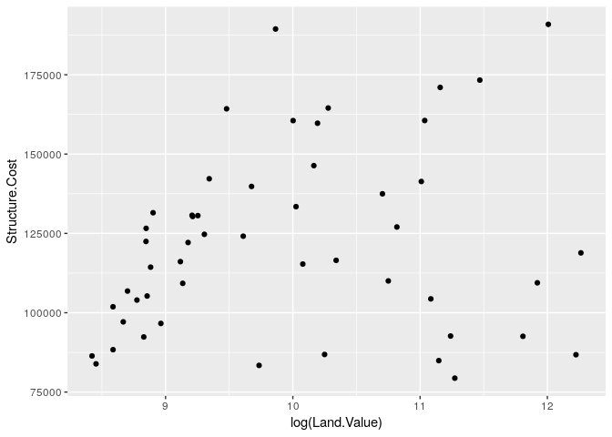
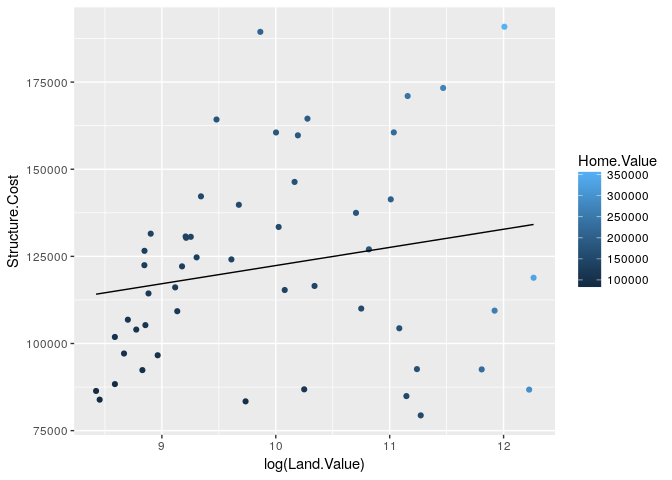
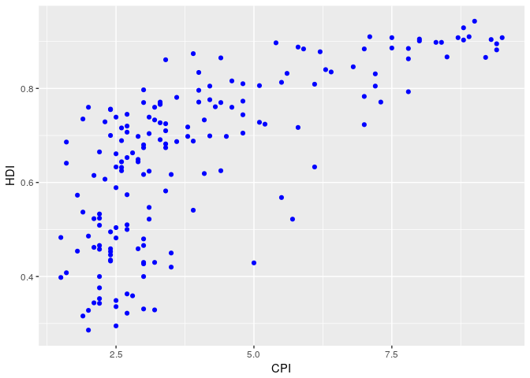
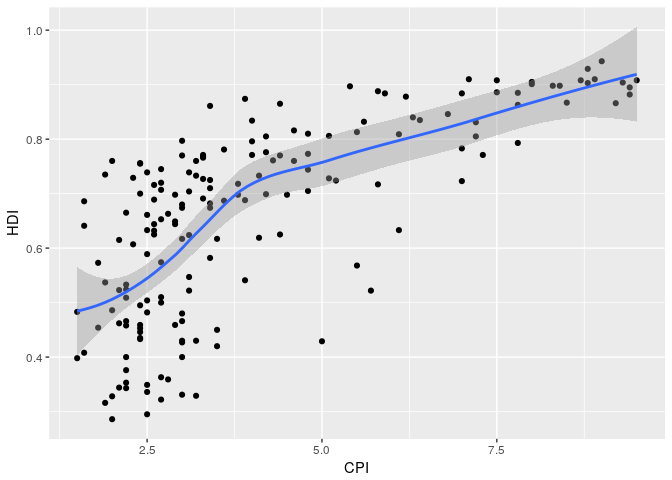
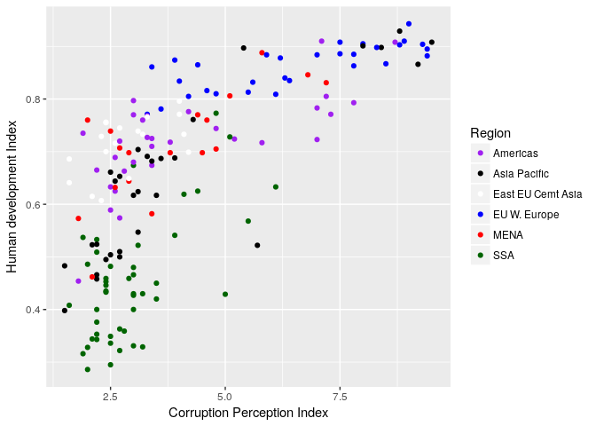
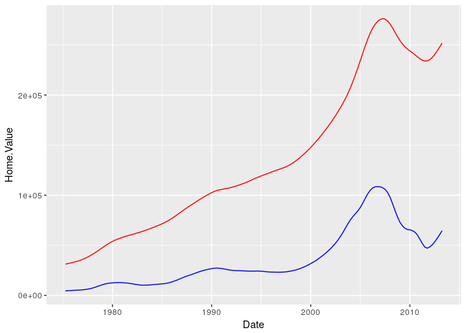

    #to see a file
    housing <- read.csv("dataSets/landdata-states.csv")
    head(housing[1:5])

    ##   State region    Date Home.Value Structure.Cost
    ## 1    AK   West 2010.25     224952         160599
    ## 2    AK   West 2010.50     225511         160252
    ## 3    AK   West 2009.75     225820         163791
    ## 4    AK   West 2010.00     224994         161787
    ## 5    AK   West 2008.00     234590         155400
    ## 6    AK   West 2008.25     233714         157458

    #graphing a specified column
    hist(housing$Home.Value)

    #give axis name, ggplot2 package
    library(ggplot2)

    ggplot(housing, aes(x = Home.Value)) +
    geom_histogram()

    ## `stat_bin()` using `bins = 30`. Pick better value with `binwidth`.

    #base colored scatter plot
    plot(Home.Value ~ Date,
         data=subset(housing, State == "MA"))
    points(Home.Value ~ Date, col="red",
           data=subset(housing, State == "TX"))
    legend(1975, 400000,
           c("MA", "TX"), title="State",
           col=c("black", "red"),
           pch=c(1, 1))

    #colored scatter in ggplot

    ggplot(subset(housing, State %in% c("MA", "TX")),
           aes(x=Date,
               y=Home.Value,
               color=State))+
      geom_point()

    #list of available geometric objects

    help.search("geom_", package = "ggplot2")

    #points, scatter plot, need x and y
    hp2001Q1 <- subset(housing, Date == 2001.25) 
    ggplot(hp2001Q1,
           aes(y = Structure.Cost, x = Land.Value)) +
      geom_point()

    #or...with log of x
    ggplot(hp2001Q1,
           aes(y = Structure.Cost, x = log(Land.Value))) +
      geom_point()

    #prediction line
    hp2001Q1$pred.SC <- predict(lm(Structure.Cost ~ log(Land.Value), data = hp2001Q1))

    p1 <- ggplot(hp2001Q1, aes(x = log(Land.Value), y = Structure.Cost))

    p1 + geom_point(aes(color = Home.Value)) +
      geom_line(aes(y = pred.SC))

    p1 +
      geom_point(aes(color = Home.Value)) +
      geom_smooth()

    ## `geom_smooth()` using method = 'loess'

    p1 + 
      geom_text(aes(label=State), size = 3)

    #install.packages("ggrepel") 
    library("ggrepel")
    p1 + 
      geom_point() + 
      geom_text_repel(aes(label=State), size = 3)

    p1 +
      geom_point(aes(size = 2),# 2 is not a variable
                 color="red") # this is fine -- all points red

    p1 +
      geom_point(aes(color=Home.Value, shape = region))

    ## Warning: Removed 1 rows containing missing values (geom_point).

    #Exercise I

    #1-Create a scatter plot with CPI on the x axis and HDI on the y axis.

    library("ggrepel")
    library(ggplot2)
    dat <- read.csv("dataSets/EconomistData.csv")
    head(dat)

    ##   X     Country HDI.Rank   HDI CPI            Region
    ## 1 1 Afghanistan      172 0.398 1.5      Asia Pacific
    ## 2 2     Albania       70 0.739 3.1 East EU Cemt Asia
    ## 3 3     Algeria       96 0.698 2.9              MENA
    ## 4 4      Angola      148 0.486 2.0               SSA
    ## 5 5   Argentina       45 0.797 3.0          Americas
    ## 6 6     Armenia       86 0.716 2.6 East EU Cemt Asia

    ggplot(dat, aes(x = CPI, y = HDI)) + geom_point()

    #2-Color the points blue.

    ggplot(dat, aes(x = CPI, y = HDI)) + geom_point(color="Blue")

    #3-Map the color of the the points to Region.

    ggplot(dat, aes(x = CPI, y = HDI)) + geom_point(aes(color=Region))

    #4-Make the points bigger by setting size to 2

    ggplot(dat, aes(x = CPI, y = HDI, size = 2)) + geom_point(aes(color=Region))

    #5-Map the size of the points to HDI.Rank

    ggplot(dat, aes(x = CPI, y = HDI)) + geom_point( aes(color=Region, size= HDI.Rank))

    args(geom_histogram)

    ## function (mapping = NULL, data = NULL, stat = "bin", position = "stack", 
    ##     ..., binwidth = NULL, bins = NULL, na.rm = FALSE, show.legend = NA, 
    ##     inherit.aes = TRUE) 
    ## NULL

    args(stat_bin)

    ## function (mapping = NULL, data = NULL, geom = "bar", position = "stack", 
    ##     ..., binwidth = NULL, bins = NULL, center = NULL, boundary = NULL, 
    ##     breaks = NULL, closed = c("right", "left"), pad = FALSE, 
    ##     na.rm = FALSE, show.legend = NA, inherit.aes = TRUE) 
    ## NULL

    p2 <- ggplot(housing, aes(x = Home.Value))
    p2 + geom_histogram()

    ## `stat_bin()` using `bins = 30`. Pick better value with `binwidth`.

    p2 + geom_histogram(stat = "bin", binwidth=4000)

    housing.sum <- aggregate(housing["Home.Value"], housing["State"], FUN=mean)
    rbind(head(housing.sum), tail(housing.sum))

    ##    State Home.Value
    ## 1     AK  147385.14
    ## 2     AL   92545.22
    ## 3     AR   82076.84
    ## 4     AZ  140755.59
    ## 5     CA  282808.08
    ## 6     CO  158175.99
    ## 46    VA  155391.44
    ## 47    VT  132394.60
    ## 48    WA  178522.58
    ## 49    WI  108359.45
    ## 50    WV   77161.71
    ## 51    WY  122897.25

    ggplot(housing.sum, aes(x=State, y=Home.Value)) + 
      geom_bar(stat="identity")

    #Exercise II

    #1-Re-create a scatter plot with CPI on the x axis and HDI on the y axis (as you did in the previous exercise).

    library("ggrepel")
    library(ggplot2)
    dat <- read.csv("dataSets/EconomistData.csv")

    ggplot(dat, aes(x = CPI, y = HDI)) + geom_point()

    #2-Overlay a smoothing line on top of the scatter plot using geom_smooth.

    ggplot(dat, aes(x = CPI, y = HDI)) + geom_point() +
      geom_smooth()

    ## `geom_smooth()` using method = 'loess'

    #3-Overlay a smoothing line on top of the scatter plot using geom_smooth, but use a linear model for the predictions. Hint: see ?stat_smooth.

    ggplot(dat, aes(x = CPI, y = HDI)) + geom_point() +
      geom_smooth(method = "lm", formula = y ~ x)

    #4-Overlay a smoothing line on top of the scatter plot using geom_line. Hint: change the statistical transformation.
    ggplot(dat, aes(x = CPI, y = HDI)) + geom_point() +
      geom_line(stat="smooth")

    ## Warning: Computation failed in `stat_smooth()`:
    ## object 'auto' of mode 'function' was not found

    #5-BONUS: Overlay a smoothing line on top of the scatter plot using the default loess method, but make it less smooth. Hint: see ?loess.

    ggplot(dat, aes(x = CPI, y = HDI)) + geom_point() +
      geom_smooth(formula = y ~ x, span=0.3)

    ## `geom_smooth()` using method = 'loess'

    p3 <- ggplot(housing,
                 aes(x = State,
                     y = Home.Price.Index)) + 
            theme(legend.position="top",
                  axis.text=element_text(size = 6))
    (p4 <- p3 + geom_point(aes(color = Date),
                           alpha = 0.5,
                           size = 1.5,
                           position = position_jitter(width = 0.25, height = 0)))

    p4 + scale_x_discrete(name="State Abbreviation") +
      scale_color_continuous(name="",
                             breaks = c(1976, 1994, 2013),
                             labels = c("'76", "'94", "'13"))

    p4 +
      scale_x_discrete(name="State Abbreviation") +
      scale_color_continuous(name="",
                             breaks = c(1976, 1994, 2013),
                             labels = c("'76", "'94", "'13"),
                             low = "blue", high = "red")

    p4 +
      scale_color_continuous(name="",
                             breaks = c(1976, 1994, 2013),
                             labels = c("'76", "'94", "'13"),
                             low = ("blue"), high = ("red"))

    p4 +
      scale_color_gradient2(name="",
                            breaks = c(1976, 1994, 2013),
                            labels = c("'76", "'94", "'13"),
                            low = ("blue"),
                            high = ("red"),
                            mid = "gray60",
                            midpoint = 1994)

    ?muted

    #Exercise III

    #1.Create a scatter plot with CPI on the x axis and HDI on the y axis. Color the points to indicate region.

    ggplot(dat, aes(x = CPI, y = HDI)) + geom_point(aes(color=Region))

    #2-Modify the x, y, and color scales so that they have more easily-understood names (e.g., spell out "Human development Index" instead of "HDI").

    ggplot(dat, aes(x = CPI, y = HDI)) + geom_point(aes(color=Region))+scale_x_continuous(name="Corruption Perception Index")+scale_y_continuous(name="Human development Index")

    #3-Modify the color scale to use specific values of your choosing. Hint: see ?scale_color_manual.

    cols <- c("Americas"= "purple","Asia Pacific"= "black","East EU Cemt Asia"= "white","EU W. Europe"= "blue","MENA"= "red","SSA"= "darkgreen")
    ggplot(dat, aes(x = CPI, y = HDI)) +   geom_point(aes(color=Region))+scale_x_continuous(name="Corruption Perception Index")+scale_y_continuous(name="Human development Index")+scale_color_manual(values = cols)

    p5 <- ggplot(housing, aes(x = Date, y = Home.Value))
    p5 + geom_line(aes(color = State))

    (p5 <- p5 + geom_line() +
       facet_wrap(~State, ncol = 10))

    p5 + theme_linedraw()

    p5 + theme_light()

    p5 + theme_minimal() +
      theme(text = element_text(color = "turquoise"))

    #opts.png

    theme_new <- theme_bw() +
      theme(plot.background = element_rect(size = 1, color = "blue", fill = "black"),
            text=element_text(size = 12, family = "Serif", color = "ivory"),
            axis.text.y = element_text(colour = "purple"),
            axis.text.x = element_text(colour = "red"),
            panel.background = element_rect(fill = "pink"),
            strip.background = element_rect(fill = ("orange")))

    p5 + theme_new

    housing.byyear <- aggregate(cbind(Home.Value, Land.Value) ~ Date, data = housing, mean)
    ggplot(housing.byyear,
           aes(x=Date)) +
      geom_line(aes(y=Home.Value), color="red") +
      geom_line(aes(y=Land.Value), color="blue")

    library(tidyr)
    home.land.byyear <- gather(housing.byyear,
                               value = "value",
                               key = "type",
                               Home.Value, Land.Value)
    ggplot(home.land.byyear,
           aes(x=Date,
               y=value,
               color=type)) +
      geom_line()

